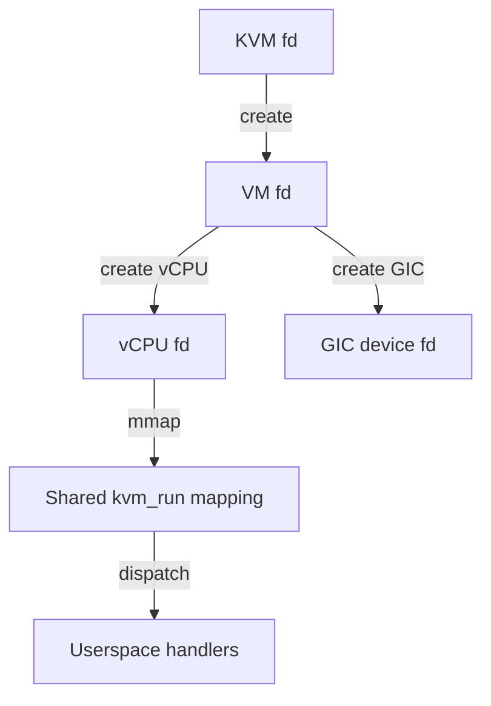

## Architecture

### Current

```mermaid
flowchart TB
  system["KVM fd"]
  vm["VM fd"]
  cpu["vCPU fd"]
  gic["GIC device fd"]
  record["Shared kvm_run mapping"]
  model["Userspace handlers"]
  system create@-->|"create"| vm
  vm vcpu@-->|"create vCPU"| cpu
  cpu map@-->|"mmap"| record
  record handle@-->|"dispatch"| model
  vm create_gic@-->|"create GIC"| gic
```
