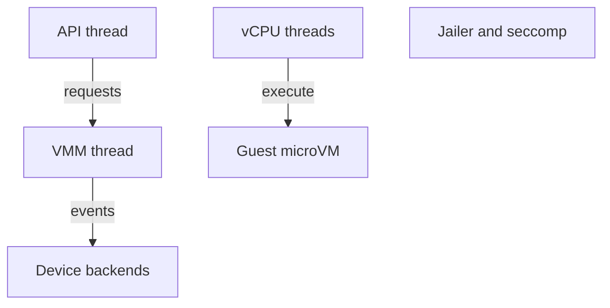

## Architecture

### Current

```mermaid
flowchart TB
  api["API thread"]
  vmm["VMM thread"]
  vcpu["vCPU threads"]
  devices["Device backends"]
  guest["Guest microVM"]
  security["Jailer and seccomp"]
  api api_control@-->|"requests"| vmm
  vmm device_work@-->|"events"| devices
  vcpu guest_run@-->|"execute"| guest
```
