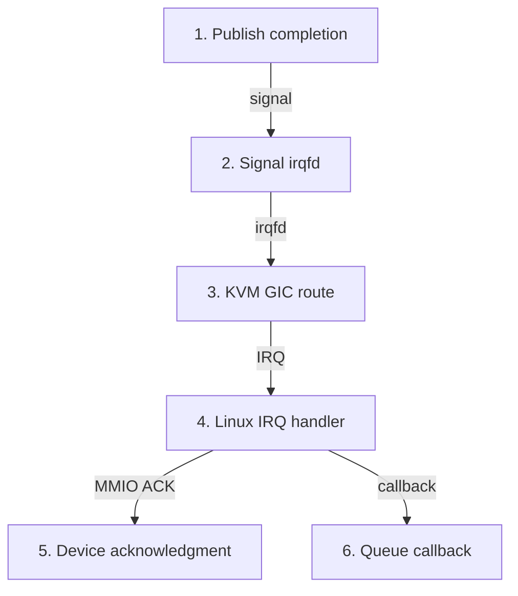

## Architecture

### Current

```mermaid
flowchart TB
  publish["1. Publish completion"]
  signal["2. Signal irqfd"]
  handler["4. Linux IRQ handler"]
  route["3. KVM GIC route"]
  ack["5. Device acknowledgment"]
  callback["6. Queue callback"]
  publish signal_irq@-->|"signal"| signal
  signal route_irq@-->|"irqfd"| route
  route deliver@-->|"IRQ"| handler
  handler ack_device@-->|"MMIO ACK"| ack
  handler queue_callback@-->|"callback"| callback
```
