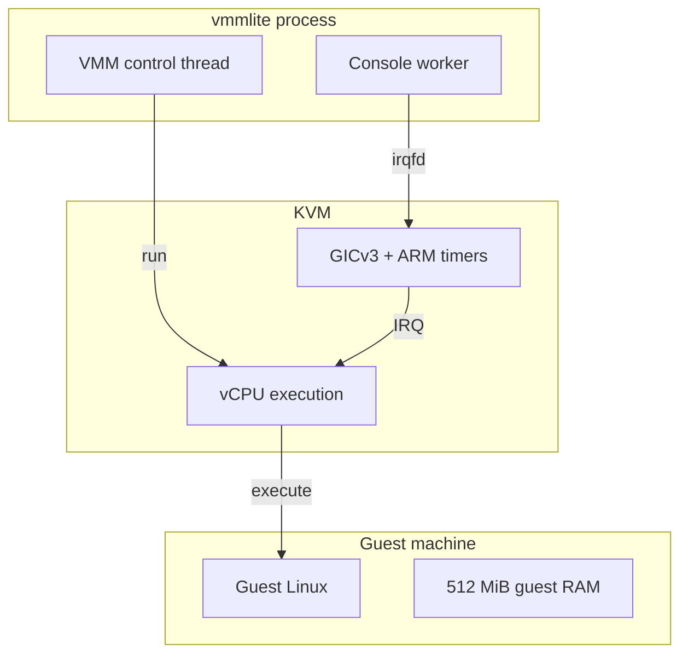

## Architecture

### Current

```mermaid
flowchart TB
  subgraph guest_vm["Guest machine"]
    guest["Guest Linux"]
    ram["512 MiB guest RAM"]
  end
  subgraph engine["KVM"]
    cpu["vCPU execution"]
    irq["GICv3 + ARM timers"]
  end
  subgraph process["vmmlite process"]
    control["VMM control thread"]
    output["Console worker"]
  end
  control run@-->|"run"| cpu
  cpu execute@-->|"execute"| guest
  output inject@-->|"irqfd"| irq
  irq deliver_cpu@-->|"IRQ"| cpu
```
