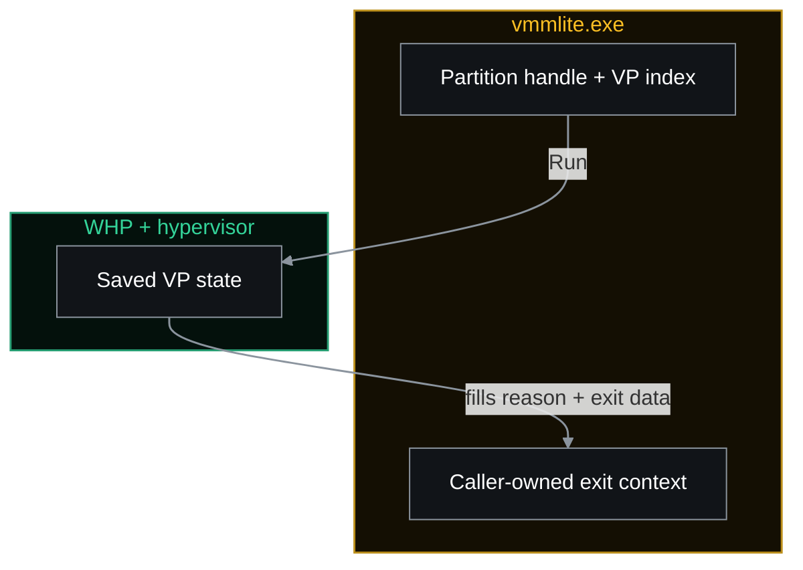

## Architecture

### Current

```mermaid
flowchart TB
  subgraph caller["vmmlite.exe"]
    handle["Partition handle + VP index"]
    exit_context["Caller-owned exit context"]
  end
  subgraph whp["WHP + hypervisor"]
    virtual_processor["Saved VP state"]
  end
  handle invoke@-->|"Run"| virtual_processor
  virtual_processor return_exit@-->|"fills reason + exit data"| exit_context
classDef scope_execution fill:#140f03,stroke:#bc8f1b,color:#fbbf24,stroke-width:1.5px
classDef scope_compute fill:#04110c,stroke:#279e73,color:#34d399,stroke-width:1.5px
class caller scope_execution
class whp scope_compute
classDef default fill:#111418,stroke:#8b949e,color:#ffffff
linkStyle default stroke:#8b949e,stroke-width:1.5px
```
