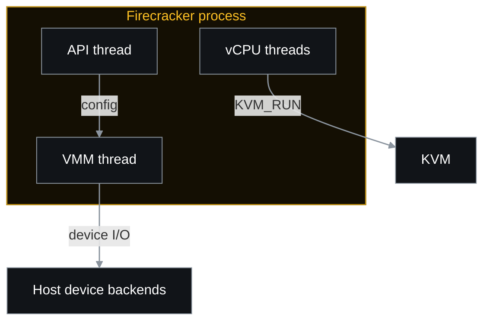

## Architecture

### Current

```mermaid
flowchart TB
  subgraph fc_process["Firecracker process"]
    fc_api["API thread"]
    fc_vmm["VMM thread"]
    fc_vcpu["vCPU threads"]
  end
  host_backing["Host device backends"]
  kvm["KVM"]
  fc_api config@-->|"config"| fc_vmm
  fc_vmm vm_io@-->|"device I/O"| host_backing
  fc_vcpu kvm_run@-->|"KVM_RUN"| kvm
classDef scope_execution fill:#140f03,stroke:#bc8f1b,color:#fbbf24,stroke-width:1.5px
class fc_process scope_execution
classDef default fill:#111418,stroke:#8b949e,color:#ffffff
linkStyle default stroke:#8b949e,stroke-width:1.5px
```
