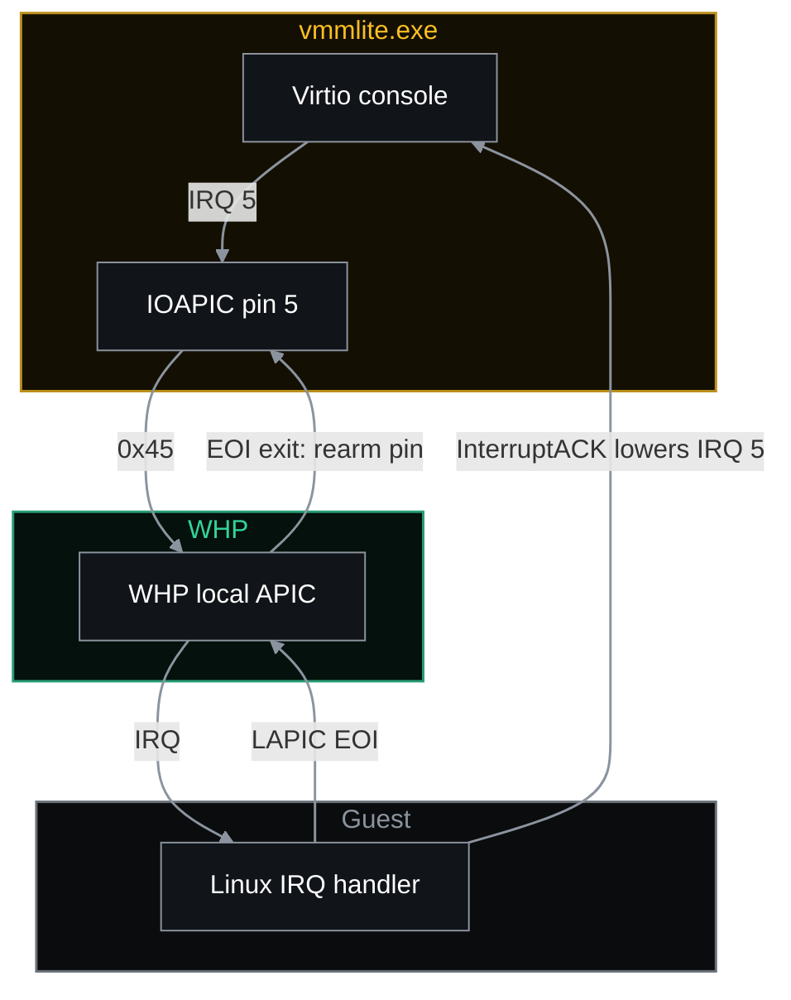

## Architecture

### Current

```mermaid
flowchart TB
  subgraph device_process["vmmlite.exe"]
    console["Virtio console"]
    ioapic["IOAPIC pin 5"]
  end
  subgraph interrupt_engine["WHP"]
    local_apic["WHP local APIC"]
  end
  subgraph guest["Guest"]
    linux["Linux IRQ handler"]
  end
  console assert_line@-->|"IRQ 5"| ioapic
  ioapic inject_vector@-->|"0x45"| local_apic
  local_apic deliver@-->|"IRQ"| linux
  linux device_ack@-->|"InterruptACK lowers IRQ 5"| console
  linux lapic_eoi@-->|"LAPIC EOI"| local_apic
  local_apic rearm@-->|"EOI exit: rearm pin"| ioapic
classDef scope_execution fill:#140f03,stroke:#bc8f1b,color:#fbbf24,stroke-width:1.5px
classDef scope_compute fill:#04110c,stroke:#279e73,color:#34d399,stroke-width:1.5px
classDef scope_external fill:#0b0c0d,stroke:#686f76,color:#8b949e,stroke-width:1.5px
class device_process scope_execution
class interrupt_engine scope_compute
class guest scope_external
classDef default fill:#111418,stroke:#8b949e,color:#ffffff
linkStyle default stroke:#8b949e,stroke-width:1.5px
```
