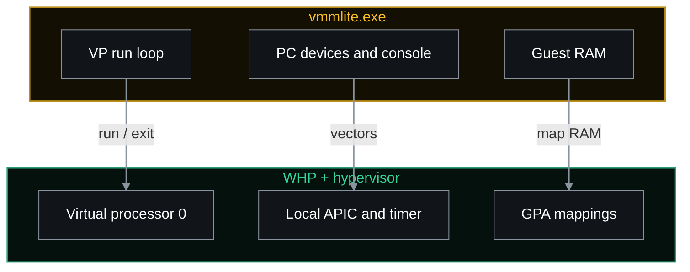

## Architecture

### Current

```mermaid
flowchart TB
  subgraph process["vmmlite.exe"]
    run["VP run loop"]
    devices["PC devices and console"]
    ram["Guest RAM"]
  end
  subgraph engine["WHP + hypervisor"]
    vp["Virtual processor 0"]
    lapic["Local APIC and timer"]
    mapping["GPA mappings"]
  end
  run run_vp@-->|"run / exit"| vp
  devices request_irq@-->|"vectors"| lapic
  ram map_ram@-->|"map RAM"| mapping
classDef scope_execution fill:#140f03,stroke:#bc8f1b,color:#fbbf24,stroke-width:1.5px
classDef scope_compute fill:#04110c,stroke:#279e73,color:#34d399,stroke-width:1.5px
class process scope_execution
class engine scope_compute
classDef default fill:#111418,stroke:#8b949e,color:#ffffff
linkStyle default stroke:#8b949e,stroke-width:1.5px
```
